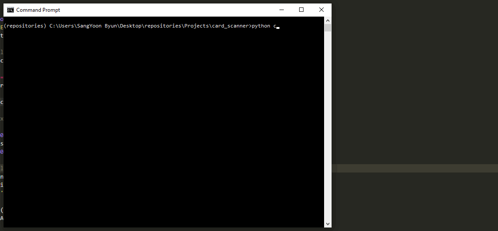

# card-scanner

## Description

Card-scanner is a scanning program that can take a photo, automatically or manually warp the image, and interpret the text within the image. While the program's primary purpose is to scan business-cards of standard size (3.5 x 2 inches), the scanning code can easily be altered to be used in other ways. A user can first take a photo using the space bar. Afterwards, the program automatically detects valid edges in attempt to identify a business card within the image. If satisfied, the user can press "y" to continue, but there is also an option (press "n") to manually redefine the edges. Once the user has confirmed the edges, the program reads the text embedded in the image.

The objective of card-scanner project was to focus on edge detection and perspective warping. The program first preprocesses the image by binarizing the gray-scaled version with a threshold using Otsu's method. Using this binary image, the program then selects significant contours based on contour areas, applies the Douglas-Peucker algorithm to search for similar curves with fewer points, and finally draws a line around the detected object if it is a four-sided convex shape.

The card-scanner program also utilizes [Pytesseract](https://github.com/madmaze/pytesseract), an optical character recognition (OCR) tool for python. Using OCR, the program can accurately recognize the text contents within an image. However, the OCR tool may possibly have some difficulties handling photos taken by laptop cameras most likely because of the low resolution. It will obviously work better with higher quality images. The Pytesseract documentation above provides detailed instructions for installation. It is advised to make sure to read the "Prerequisites" section. I personally used [Tesseract at UB Mannheim](https://github.com/UB-Mannheim/tesseract/wiki) for a Windows version.

## Installation

I used the OpenCV package for python (version 4.1.0.25 or above) with Python 3.7.2

```bash
pip install opencv-python==4.1.0.25
```

## Usage

Clone the handmotion-control repository in your directory.

```bash
git clone https://github.com/byunsy/card-scanner.git
```

Move to your specific directory and execute the program.

```bash
python card_scanner.py
```

- Press space bar to take a photo.
- Press "y" or "Y" if satisfied with the auto-detected edges.
- Press "n" or "N" if you would like to manually redefine the edges.

## Demonstrations

Case 1. The program can accurately detect and read a simple business card.


Case 2. The program can detect and warp a tilted business card into a correct position.


Case 3. The program can detect and read a more complex business card. However, note that it read the '&' symbol as '4'.



Case 4. When the program failed to automatically detect the card edges due to occlusion or shadows, the user can manually redefine the edges.


### Note

The sample business cards used in the demonstrations above are mockups created by me. The names, phone numbers, companies, and addresses in the cards are not real in any cases.
